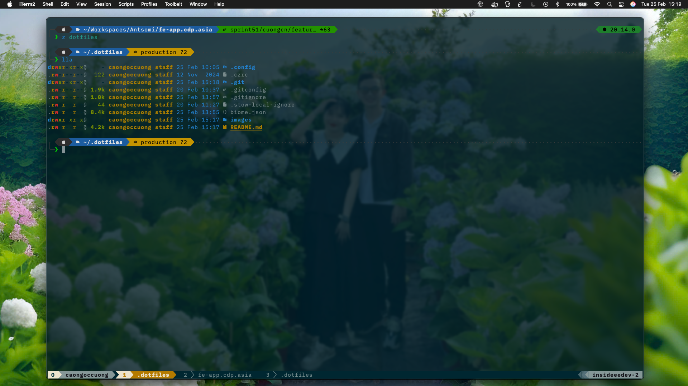
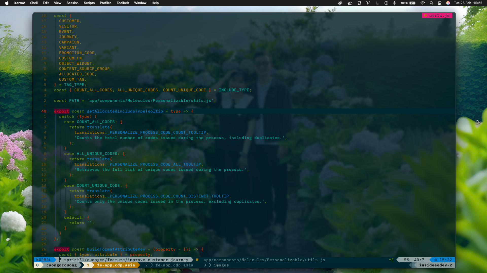
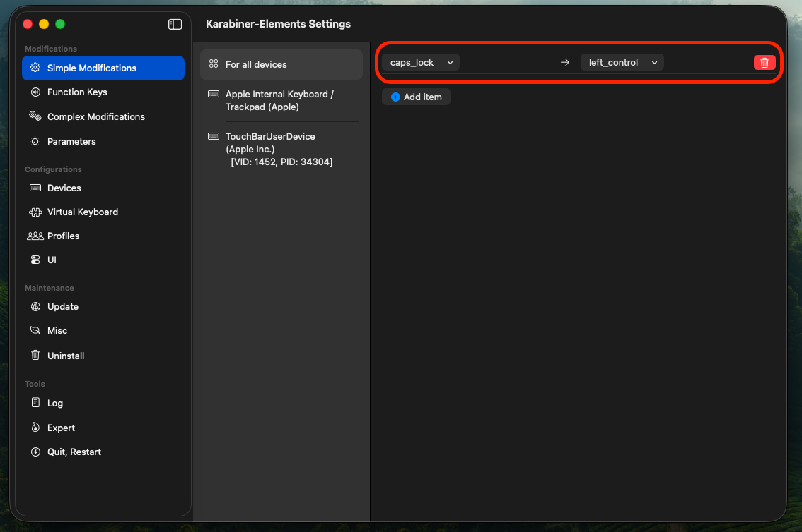
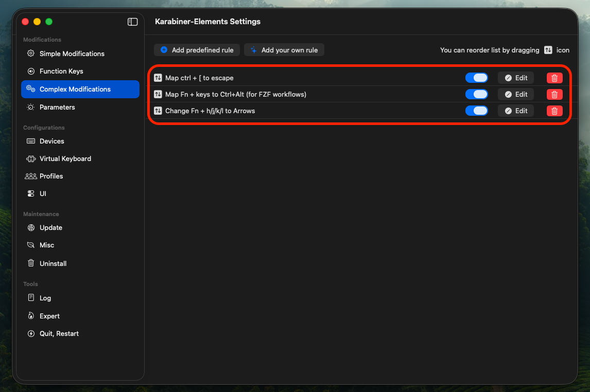
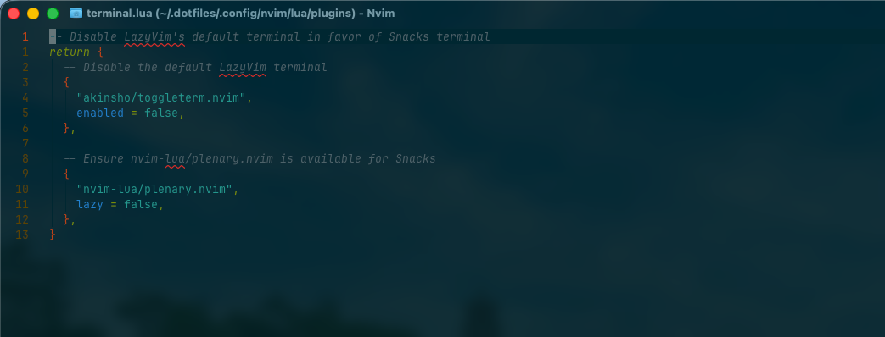

**Warning**: Don’t blindly use my settings unless you know what that entails. Use at your own risk!

## **📌 Contents**
- **Neovim** – Custom plugins, keybindings, and themes
- **Tmux** – Optimized terminal workflow
- **Git** – Configuration for efficient version control
- **Karabiner** – Custom key mappings for Vim efficiency
- **Fish Shell** – Enhanced terminal experience
- **GNU Stow** – Simple dotfiles management

---

## **🚀 Setting Up a New Machine with This Repo**
This repository uses **GNU Stow** to manage dotfiles efficiently with symlinks. Follow these steps to set up your new machine:

### **1. Install Required Packages**
#### **Install Stow & Essential Tools**
**macOS:**
```sh
brew install stow git fish tmux neovim
```
**Linux (Debian/Ubuntu):**
```sh
sudo apt update && sudo apt install stow git fish tmux neovim
```
**Linux (Arch):**
```sh
sudo pacman -S stow git fish tmux neovim
```

#### Install **Fisher**
A plugin manager for Fish  
**macOS:**
```sh
curl -sL https://raw.githubusercontent.com/jorgebucaran/fisher/main/functions/fisher.fish | source && fisher install jorgebucaran/fisher
```

#### Install **Tide** after installed **fisher** *(optional)*
The ultimate Fish prompt.  


**macOS:**
```sh
fisher install IlanCosman/tide@v6
```

### **2. Clone This Repository**
```sh
git clone https://github.com/crafts-cnc/.dotfiles.git ~/.dotfiles
cd ~/.dotfiles
```

### **3. Apply Dotfiles Using Stow**
To symlink all configurations:
```sh
# Using run script (recommended)
~/.dotfiles/stow_setup.sh

# Without script
stow -v . # [Add -R flag if need]
```
To symlink specific configurations:
```sh
# Stow .config package contains fish, tmux, nvim,...
stow -v ~/.dotfiles/.config

# Stow biome file configurations
stow -v ~/.dotfiles/biome.json
```

### **4. Restart Your Shell** (*optional*)
```sh
exec fish  # or exec zsh
```

### **5. Verify the Setup** (*optional*)
Check if configurations are correctly applied:
```sh
echo $SHELL   # Should show fish or zsh
nvim --version  # Ensure Neovim is installed
```

---

## **🚀 Karabiner Element Application**
I use Karabiner to customize some keys for my keyboard to make Vim easier to use.

### **Installation**
```sh
brew install --cask karabiner-elements
```
Search in the registry:
- [Vim style escape key mapping](https://ke-complex-modifications.pqrs.org/?q=escape%20to%20ctrl%20%2B%20%5B)
- [Vim style arrows](https://ke-complex-modifications.pqrs.org/?q=vim%20style%20arrows)




---

## **🛠 Neovim Setup**
### **Requirements**
- Neovim >= **0.9.0** (with **LuaJIT**)
- Git >= **2.19.0**
- [LazyVim](https://www.lazyvim.org/)
- A [Nerd Font](https://www.nerdfonts.com/) (v3.0+ for icons)
- [lazygit](https://github.com/jesseduffield/lazygit) (optional)
- A **C** compiler for `nvim-treesitter`
- [Telescope.nvim](https://github.com/nvim-telescope/telescope.nvim) dependencies:
  - **Live grep**: [ripgrep](https://github.com/BurntSushi/ripgrep)
  - **Find files**: [fd](https://github.com/sharkdp/fd)
- Supported Terminals:
  - [Kitty](https://github.com/kovidgoyal/kitty)
  - [WezTerm](https://github.com/wez/wezterm)
  - [Alacritty](https://github.com/alacritty/alacritty)
  - [iTerm2](https://iterm2.com/)
- [Solarized Osaka](https://github.com/craftzdog/solarized-osaka.nvim)

---

## **🎨 Enable `undercurl` in iTerm2**
### **1. Export TERM in your shell config**
Add this to your `~/.zshrc` or `~/.bashrc`:
```sh
export TERM="xterm-256color"
[[ -n $TMUX ]] && export TERM="screen-256color"
```
Restart your shell after making the changes.

### **2. Configure Neovim**
Add the following options in `init.lua` or `~/.config/nvim/lua/config/options.lua`:
```lua
vim.opt.spell = true
vim.opt.spelllang = { 'en_us' }
```

### **3. Generate Terminal Description**
Run:
```sh
infocmp > /tmp/$TERM.ti
```

### **4. Edit Terminal Description**
Open `/tmp/$TERM.ti` and find this line:
```sh
smul=\E[4m,
```
Modify it by adding:
```sh
 Smulx=\E[4:%p1%dm,
```
Save the file.

### **5. Compile Terminal Description**
Run:
```sh
tic -x /tmp/$TERM.ti
```

### **6. Restart iTerm2 and Test**
Close and reopen iTerm2, then check if undercurl works:
```sh
echo -e "\e[4:3mUndercurl Test\e[0m"
```


---

## **📜 How to Use**
1. [Takuya's blog - vim-setup-to-speed-up-javascript-coding-for-my-electron-and-react-native-apps](https://dev.to/craftzdog/my-vim-setup-to-speed-up-javascript-coding-for-my-electron-and-react-native-apps-4ebp)
2. [Takuya's blog - a-productive-command-line-git-workflow-for-indie-app-developers](https://dev.to/craftzdog/a-productive-command-line-git-workflow-for-indie-app-developers-k7d)
3. [GNU Stow cheat sheet](https://community.inkdrop.app/1670abd373a245635cce1efd87fb95d5/PHQECLN_)

---

## **📌 About Me**
- [LinkedIn](https://www.linkedin.com/in/cuong-cao-ngoc-792992229/)
- [GitHub](https://github.com/crafts69guy?tab=repositories)
- [Facebook](https://www.facebook.com/tony.cuong.39142/)
- 📧 Email: `crafts69@guy@gmail.com`

🚀 **Happy Coding!**

