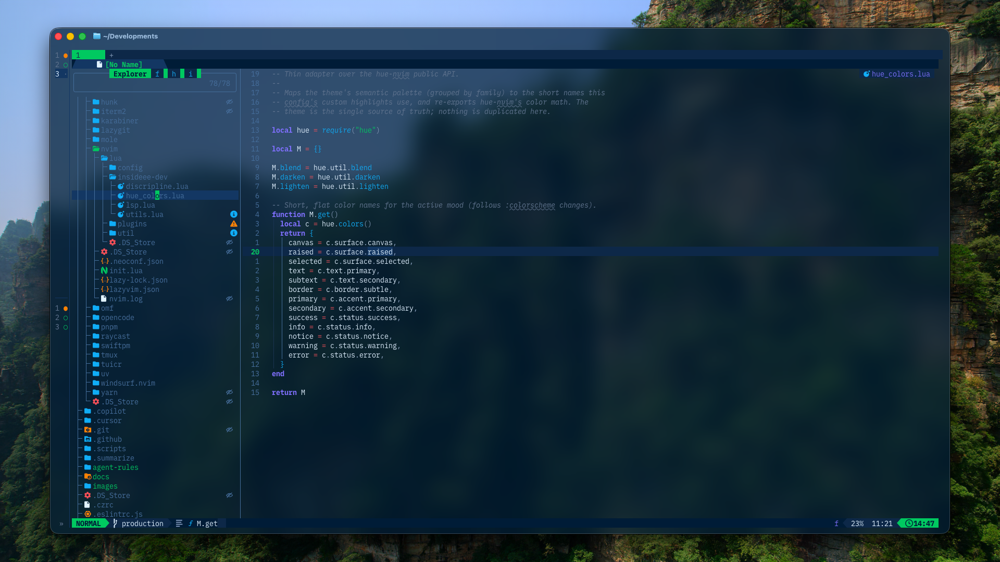
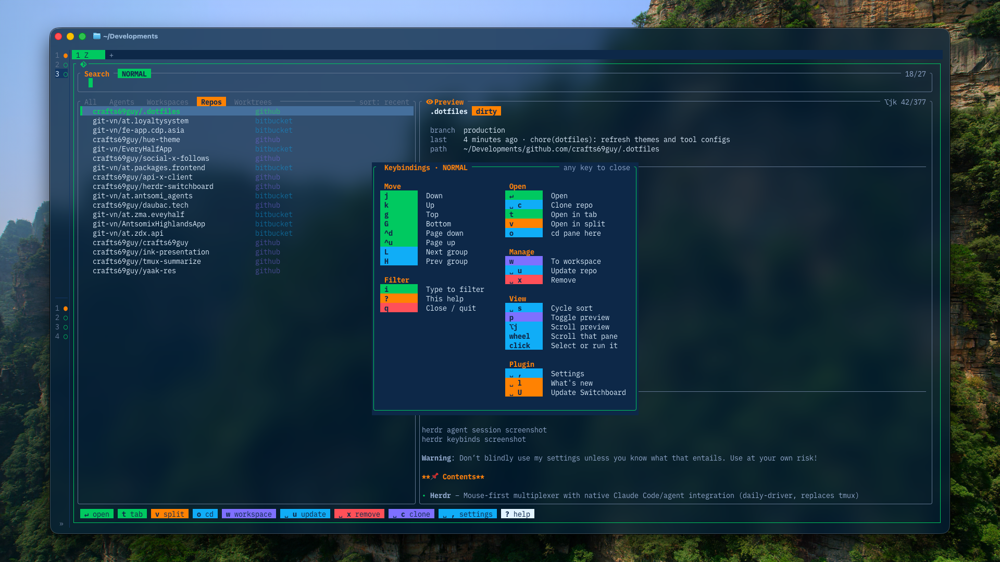
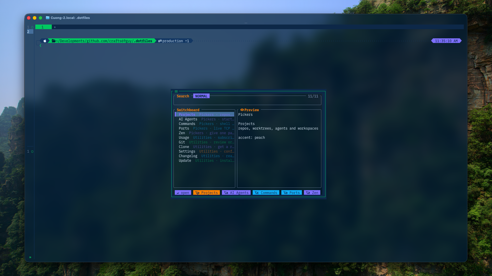
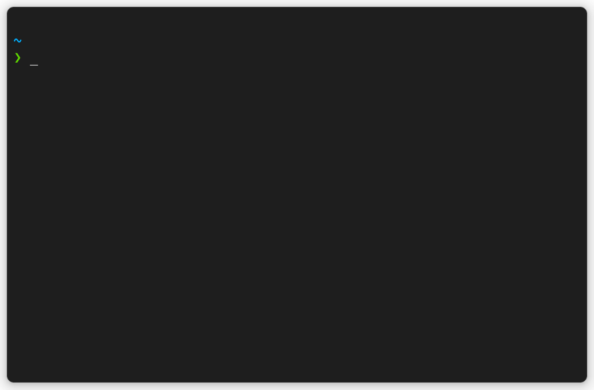
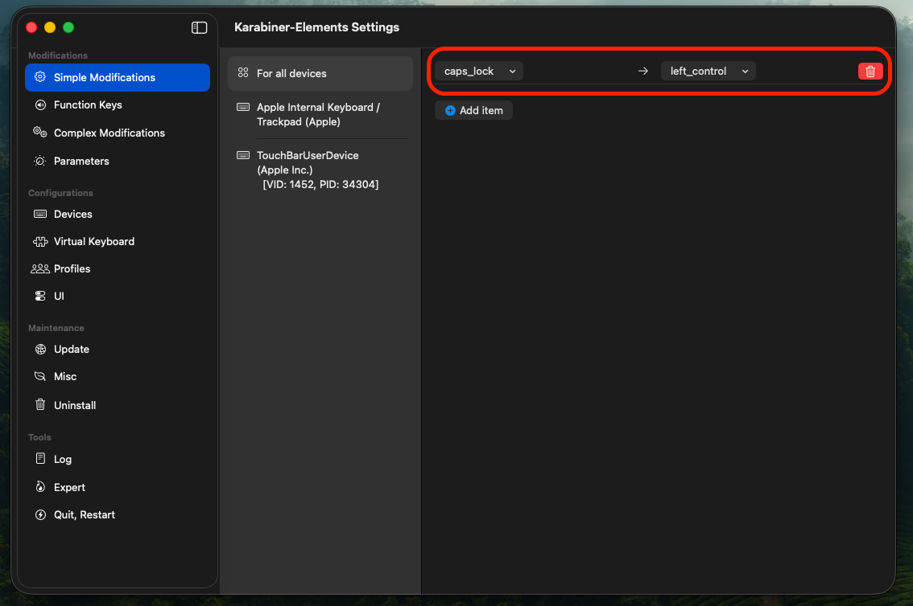
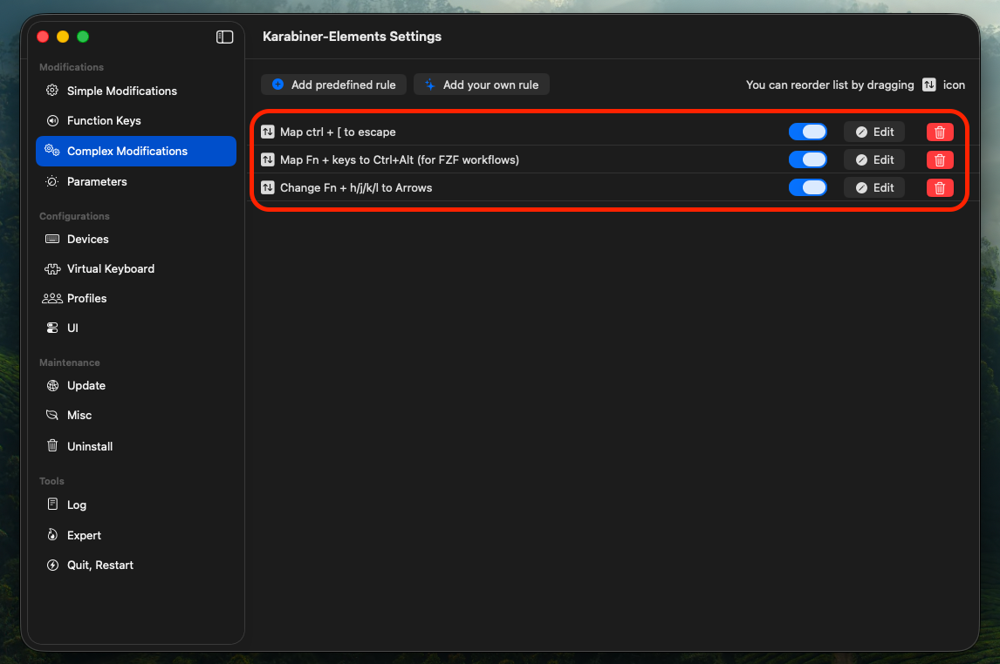
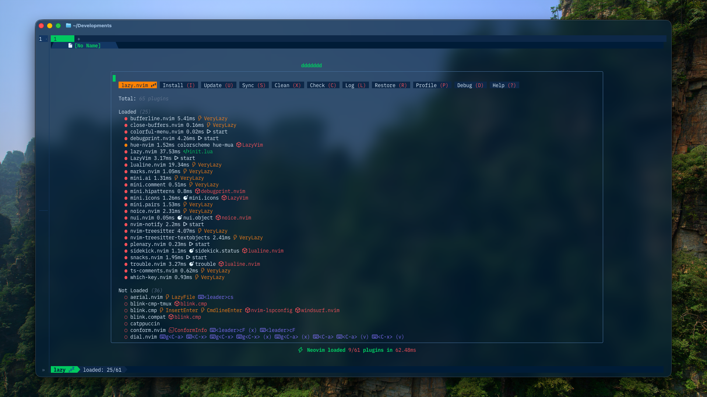

**Warning**: Don’t blindly use my settings unless you know what that entails. Use at your own risk!

## **📌 Contents**

- **Herdr** – Mouse-first multiplexer with native Claude Code/agent integration (daily-driver, replaces tmux)
- **Tmux** – Kept as a minimal fallback for remote/SSH-only boxes without herdr
- **Neovim** – Custom plugins, keybindings, and themes (LazyVim)
- **Hue Theme** – Custom Huế-inspired theme system across Fish/Tide, herdr, Ghostty, tmux, and Neovim
- **Git** – Configuration for efficient version control
- **Karabiner** – Custom key mappings with Fn (Hyper) key
- **Fish Shell** – Enhanced terminal experience with Tide prompt
- **FZF** – Fuzzy finder with fd, ripgrep, bat integration
- **Agent Rules** – Shared rule packs for Claude, Codex, Inkdrop, and stack-specific workflows
- **GNU Stow** – Simple dotfiles management

---

## **🚀 Setting Up a New Machine with This Repo**

This repository uses **GNU Stow** to manage dotfiles efficiently with symlinks. Follow these steps to set up your new machine:

### **1. Install Required Packages**

#### **Install Stow & Essential Tools**

**macOS:**

```sh
brew install stow git fish tmux neovim fd ripgrep bat eza fzf
```

**Linux (Debian/Ubuntu):**

```sh
sudo apt update && sudo apt install stow git fish tmux neovim
```

**Linux (Arch):**

```sh
sudo pacman -S stow git fish tmux neovim
```

#### **Install herdr (daily-driver multiplexer)**

herdr (https://herdr.dev) replaces tmux as the daily-driver terminal
multiplexer; tmux is kept as a minimal fallback for remote/SSH-only boxes.

```sh
curl -fsSL https://herdr.dev/install.sh | sh
herdr integration install claude
herdr plugin install crafts69guy/hue-theme/packages/herdr-plugin
```

#### Install **Fisher**

A plugin manager for Fish  
**macOS:**

```sh
curl -sL https://raw.githubusercontent.com/jorgebucaran/fisher/main/functions/fisher.fish | source && fisher install jorgebucaran/fisher
```

#### Install **Tide** after installed **fisher** _(optional)_

The ultimate Fish prompt.



**macOS:**

```sh
fisher install IlanCosman/tide@v6
```

The Tide prompt colors are loaded from the generated Hue theme checkout without
copying generated files into this dotfiles repo. By default the Fish config looks
for `~/Developments/github.com/crafts69guy/hue-theme`; on another machine, set:

```fish
set -Ux HUE_THEME_HOME /path/to/hue-theme
```

Then restart Fish with `exec fish`.

#### Hue theme switcher

Use the Fish command below to switch the Hue mood across Fish/Tide, herdr,
tmux, Ghostty, and Neovim:

```fish
hue-theme mua
hue-theme huong
hue-theme cung
```

The command stores the active mood in `~/.local/state/hue-theme/current`, so
switching moods does not dirty this dotfiles repo. Dotfiles keep the switcher,
host integration, and Ghostty theme files versioned. herdr has no scriptable
theme API of its own, so its mood is applied by a separate herdr plugin (see
[Herdr](#-herdr) below) that `hue-theme` triggers automatically.

### **2. Clone This Repository**

```sh
git clone https://github.com/crafts69guy/.dotfiles.git ~/.dotfiles
cd ~/.dotfiles
```

### **3. Apply Dotfiles Using Stow**

To symlink all configurations:

```sh
# Using run script (recommended)
~/.dotfiles/stow_setup.sh

# Without script
stow -v . # [Add -R flag if need]
```

To symlink specific configurations:

```sh
# Stow .config package contains fish, tmux, nvim,...
stow -v ~/.dotfiles/.config

# Stow biome file configurations
stow -v ~/.dotfiles/biome.json
```

### **4. Restart Your Shell** (_optional_)

```sh
exec fish  # or exec zsh
```

### **5. Verify the Setup** (_optional_)

Check if configurations are correctly applied:

```sh
echo $SHELL   # Should show fish or zsh
nvim --version  # Ensure Neovim is installed
test -f ~/agent-rules/README.md && echo "Agent rules linked"
```

---

## **🤖 Agent Rules**

This repo includes shared rule packs under `agent-rules/` for multi-agent workflows. `CLAUDE.md`, `AGENTS.md`, and Codex skills should stay thin and route agents to these shared rules instead of duplicating long policies.

Key entry points:

- `agent-rules/README.md` – Cross-agent routing index
- `agent-rules/shared/` – General Markdown and research/citation rules
- `agent-rules/tools/inkdrop-v6/` – Inkdrop v6 note-taking, Mermaid, links, organization, and MCP token workflow
- `agent-rules/tools/herdr/` – Herdr multiplexer config, agent panes, socket API scripting
- `agent-rules/stacks/` – Stack-specific rules for React Native, Medusa, and Web3

After stowing this repo, agents can resolve the shared rules from `~/agent-rules/...`.

---

## **🐚 Herdr**

[Herdr](https://herdr.dev) is a mouse-first terminal multiplexer with native
lifecycle-hook integration for AI coding agents (Claude Code, opencode, and
others) — it reports `idle`/`working`/`blocked` pane state directly instead of
polling, and shows it in its sidebar (screenshots at the top of this README).

- Config: `.config/herdr/config.toml` — prefix `ctrl+t` (same muscle memory as
  the tmux fallback below), lazygit/git-graph popups on `prefix+alt+g` /
  `prefix+alt+shift+g`, mouse-first pane splitting, nested-session protection,
  and pane history enabled.
- Fish aliases: `hr` launches/attaches Herdr; `hrl` applies the saved IDE pane
  layout from `.scripts/ide-herdr`.
- Navigation: workspace navigation mode uses `j`/`k` for down/up, workspace
  switching uses `prefix+ctrl+j/k`, agent switching uses `prefix+alt+j/k`, and
  `prefix+alt+1..9` jumps directly to agent panes.
- Agent integration: `herdr integration install claude` (and `opencode`) wires
  up native session-state hooks — see `agent-rules/tools/herdr/README.md` for
  the socket API/plugin caveats.
- Theming: herdr has no scriptable theme API, so the Hue Tide theme is applied
  by a small herdr plugin (`crafts69guy/hue-theme`, `packages/herdr-plugin`)
  that `hue-theme.fish` triggers — see the Hue theme switcher above.
- tmux (`.config/tmux/tmux.conf`) is kept as a trimmed-down fallback for
  remote/SSH-only boxes without herdr installed; its `tpm`/`tmux-summarize`
  plugins still apply there.

---

## **🚀 Karabiner Element Application**

I use Karabiner to customize keyboard mappings for Vim efficiency.

### **Installation**

```sh
brew install --cask karabiner-elements
```

### **Custom Mappings**

**Vim Efficiency:**

- `Caps Lock` → `Left Control`
- `Ctrl + [` → `Escape`
- `Fn + h/j/k/l` → Arrow keys

Search in the registry:

- [Vim style escape key mapping](https://ke-complex-modifications.pqrs.org/?q=escape%20to%20ctrl%20%2B%20%5B)
- [Vim style arrows](https://ke-complex-modifications.pqrs.org/?q=vim%20style%20arrows)




## **🔍 FZF Setup**

Comprehensive fuzzy finder integration with modern CLI tools, based on [official fzf documentation](https://github.com/junegunn/fzf).

### **Dependencies**

```sh
brew install fzf fd ripgrep bat eza ghq
```

### **Features**

- **fd** – Fast file/directory search (replaces find)
- **ripgrep** – Fast text search with live reload
- **bat** – Syntax-highlighted file previews
- **eza** – Modern ls with tree view for directories
- **Solarized Dark** theme matching Ghostty terminal
- **ghq** – Project management

### **Configuration Files**

- `.config/fish/conf.d/fzf.fish` – FZF environment variables
- `.config/fish/functions/fzf_*.fish` – Individual workflow functions

---

## **🛠 Neovim Setup**



### **Requirements**

- Neovim >= **0.9.0** (with **LuaJIT**)
- Git >= **2.19.0**
- [LazyVim](https://www.lazyvim.org/)
- A [Nerd Font](https://www.nerdfonts.com/) (v3.0+ for icons)
- [lazygit](https://github.com/jesseduffield/lazygit) (optional)
- A **C** compiler for `nvim-treesitter`
- [Snacks.nvim picker](https://github.com/folke/snacks.nvim) dependencies:
  - **Live grep**: [ripgrep](https://github.com/BurntSushi/ripgrep)
  - **Find files**: [fd](https://github.com/sharkdp/fd)
- Supported Terminals:
  - [Ghostty](https://ghostty.org) (primary; config at `.config/ghostty/`)
  - [Kitty](https://github.com/kovidgoyal/kitty)
  - [WezTerm](https://github.com/wez/wezterm)
  - [Alacritty](https://github.com/alacritty/alacritty)
- Colorscheme: [hue-nvim](https://github.com/crafts69guy/hue-theme) — the same
  Hue Tide mood system used across Fish/Tide, herdr, Ghostty, and tmux (see
  the Hue theme switcher above)
- Plugin versions are pinned in `.config/nvim/lazy-lock.json` and should be
  committed whenever Lazy updates the lockfile.

---

## **📜 How to Use**

1. [Takuya's blog - vim-setup-to-speed-up-javascript-coding-for-my-electron-and-react-native-apps](https://dev.to/craftzdog/my-vim-setup-to-speed-up-javascript-coding-for-my-electron-and-react-native-apps-4ebp)
2. [Takuya's blog - a-productive-command-line-git-workflow-for-indie-app-developers](https://dev.to/craftzdog/a-productive-command-line-git-workflow-for-indie-app-developers-k7d)
3. [GNU Stow cheat sheet](https://community.inkdrop.app/1670abd373a245635cce1efd87fb95d5/PHQECLN_)

---

## **📌 About Me**

- [LinkedIn](https://www.linkedin.com/in/cuong-cao-ngoc-792992229/)
- [GitHub](https://github.com/crafts69guy?tab=repositories)
- [Facebook](https://www.facebook.com/tony.cuong.39142/)
- 📧 Email: `crafts69.guy@gmail.com`

🚀 **Happy Coding!**
