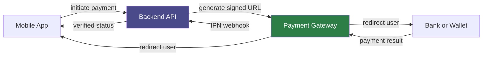
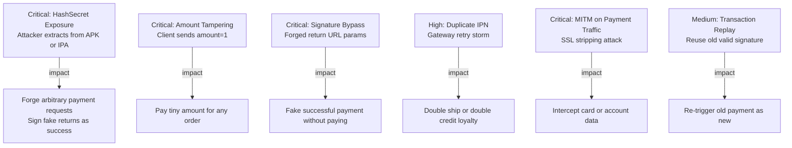

# Inkdrop v6 Mermaid Rules

Reference basis: Inkdrop Markdown docs, the `inkdrop-mermaid` plugin docs, and Mermaid v11 behavior around unsupported Markdown list content in labels.

## Rules

- Use fenced blocks with the `mermaid` language identifier.
- Prefer `flowchart LR` or `flowchart TD` for new flow diagrams.
- Keep node and edge labels plain and short. Put long explanations in Markdown outside the diagram.
- Do not use Markdown bullets or numbered lists inside labels.
- Avoid edge labels like `|1. initiate payment|`; use `|initiate payment|`.
- Do not use literal `\n` in labels. Use `<br/>` for intended line breaks.
- Avoid emoji in labels. Use text such as `Critical:` or `High:` for severity.
- Quote complex labels with `["..."]`, but keep the content to plain text and `<br/>`.

## Preflight

- No `|1. ...|`, `|2. ...|`, `- `, `* `, or Markdown-list-shaped content inside labels.
- No literal `\n` inside labels.
- Multi-line labels use `<br/>`.
- Labels are concise enough to fit inside nodes.
- Dense diagrams are split into a small diagram plus a Markdown table/list.

## Safe Payment Flow



## Safe Threat Model



## Unsafe Patterns

```text
flowchart LR
  A -->|1. initiate payment| B
  B["Critical issue\nAttacker extracts secret"]
  C["- first risk
  - second risk"]
```

The numbered edge label can be parsed as a Markdown list, literal `\n` can render visibly, and bullet-like label content can trigger `Unsupported markdown: list`.
